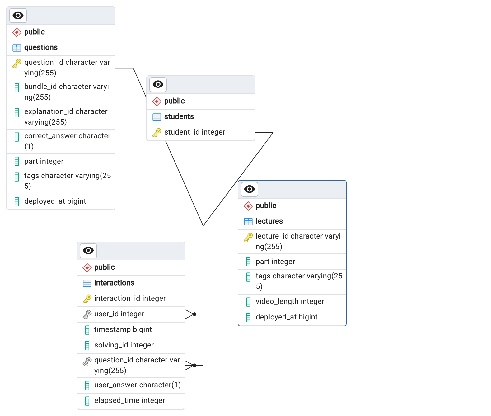
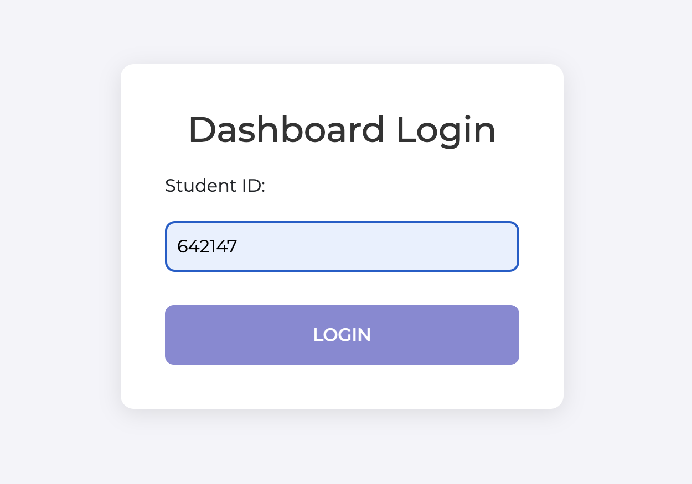
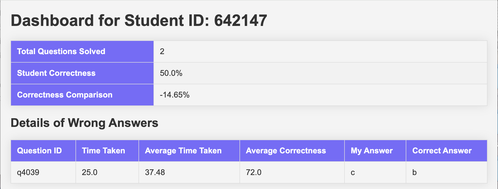

# QuizDashboard

## Introduction
- This project develops an end-to-end student question-solving dashboard & lecture diagnosis system, leveraging extensive student interaction data to enhance educational outcomes.

## Business Case
- **Educators**: Tailor teaching strategies based on concrete performance data to optimize learning.
- **Students**: Gain insights into their learning process, identifying strengths and areas for improvement.
- **Institutions**: Leverage data to ensure content effectiveness and uphold academic integrity.

## Data Description
- **Dataset**: EdNet-KT1, sourced from [Github](https://github.com/riiid/ednet "EdNet"), captures over 131 million interactions from more than 780K users on the Santa platform.
- **Contents**: Includes detailed logs of user interactions with quiz questions and lectures over a span of two years, providing a comprehensive view of student learning behaviors.

## Project Workflow
- **Data Loading**: Data is loaded into a PostgreSQL database, utilizing Python scripts for efficient handling.
- **Analysis**: Apache Spark processes the data to generate insights on student performance and lecture effectiveness.
- **Visualization**: A Flask-based web application displays the results on a dynamic student dashboard.

## Usage

###  :electric_plug: Installation
- Installing package dependencies.

```
$ install -r requirements.py
```

Load data to postgresql database, which prompts user input for database credentials.
```
$ python LoadData.py
```
The db structure looks like:


Generate student dashboard: 
```
$ python spark.py
```

### Demo





